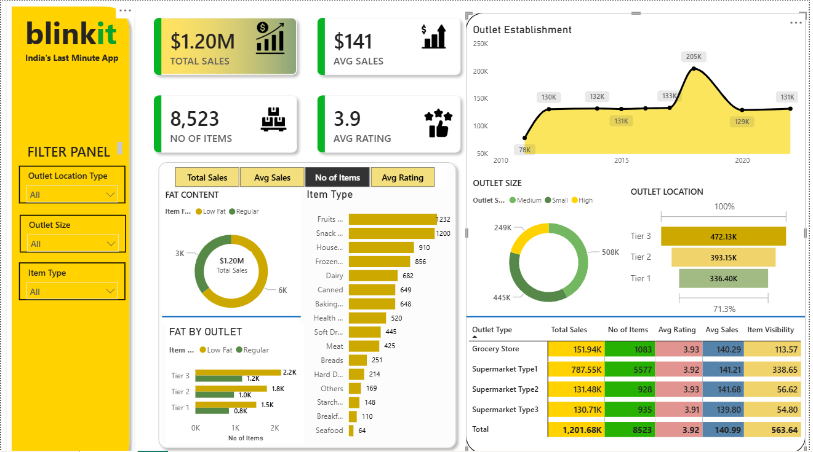

# BlinkIT Retail Sales Analytics Dashboard

## Overview

This project is an interactive Power BI dashboard developed to analyze BlinkIT grocery sales performance, outlet distribution, product categories, customer ratings, and inventory insights.

The dashboard enables business stakeholders to monitor key performance indicators (KPIs), identify sales trends, evaluate outlet performance, and make data-driven decisions.

---

## Dashboard Preview

---

## Key Business Metrics

- Total Sales: $1.20M
- Average Sales: $141
- Number of Items: 8,523
- Average Rating: 3.9

---

## Features

### Sales Analysis
- Total revenue tracking
- Average sales monitoring
- Year-wise outlet establishment trend

### Product Analysis
- Item type distribution
- Fat content analysis
- Product category performance

### Outlet Analysis
- Outlet location comparison
- Outlet size performance
- Outlet type performance

### Interactive Filters
Users can filter dashboard data based on:
- Outlet Location Type
- Outlet Size
- Item Type

### Performance KPIs
- Total Sales
- Average Sales
- Number of Items
- Average Rating
- Item Visibility

---

## Dashboard Insights

### Outlet Performance
- Tier 3 outlets generate the highest sales.
- Medium-sized outlets contribute the largest portion of revenue.

### Product Performance
- Fruits and Vegetables are among the top-selling categories.
- Snack Foods show strong sales performance.

### Customer Ratings
- Average product rating remains around 3.9 across outlet types.

### Historical Trend
- Outlet establishments peaked around 2018 with approximately 205K sales.

---

## Tools & Technologies

- Power BI Desktop
- DAX (Data Analysis Expressions)
- Power Query
- Excel Dataset
- Data Modeling
- Interactive Visualizations

---

## Dataset Information

The dataset contains information related to:

- Product Categories
- Outlet Types
- Outlet Sizes
- Outlet Locations
- Item Visibility
- Sales
- Ratings

---

## Skills Demonstrated

- Data Cleaning
- Data Transformation
- Data Modeling
- DAX Measures
- KPI Design
- Dashboard Development
- Business Intelligence
- Data Visualization
- Retail Analytics

---

## Project Structure

├── BlinkIT Grocery Data.xlsx
├── blinkit.pbix
├── Dashboard Screenshot.png
└── README.md

---

## Business Impact

This dashboard helps management:

- Track overall business performance
- Identify high-performing outlet locations
- Understand customer purchasing behavior
- Improve inventory planning
- Support strategic business decisions

---

## Author

Rohan Diwakar

LinkedIn: https://www.linkedin.com/in/rohan-diwakar-a2460829a

GitHub: https://github.com/rohandiwakar
